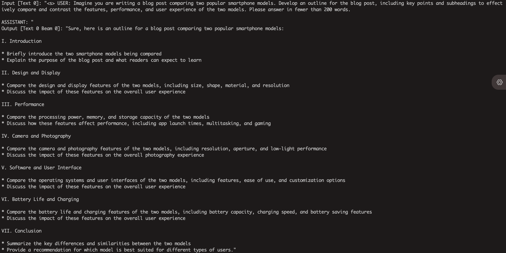
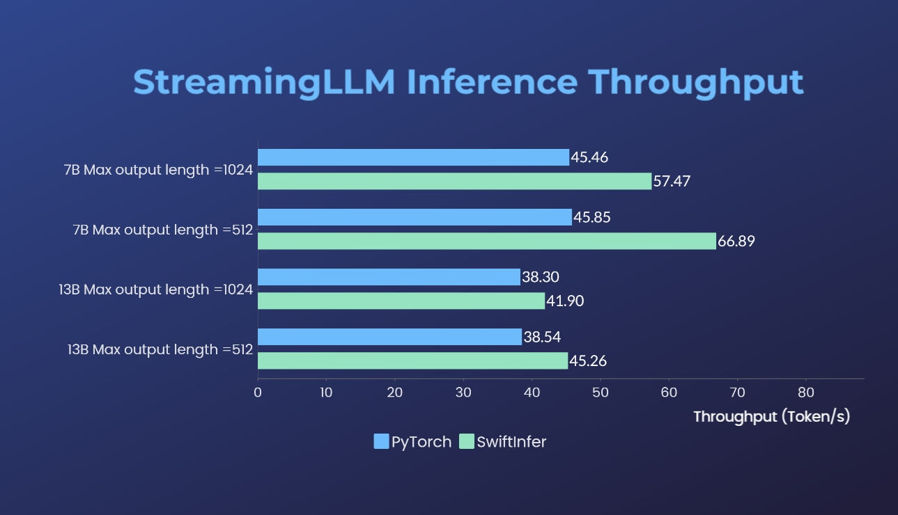

# 🚀 SwiftInfer

## 🔗 Table of Contents

- [🚀 SwiftInfer](#-swiftinfer)
  - [🔗 Table of Contents](#-table-of-contents)
  - [📌 Overview](#-overview)
  - [🚗 Quick Start](#-quick-start)
    - [🛠 Installation](#-installation)
    - [🕹 Run Llama example](#-run-llama-example)
  - [⚖️ Benchmark](#-benchmark)
  - [🗺 Roadmap](#-roadmap)
  - [📃 Acknowledgement](#-acknowledgement)
  - [📝 Citation](#-citation)

## 📌 Overview

[**Streaming-LLM**](https://github.com/mit-han-lab/streaming-llm) is a technique to support infinite input length for LLM inference. It leverages [**Attention Sink**](https://arxiv.org/abs/2309.17453) to prevent the model collapse when the attention window shifts. The original work is implemented in PyTorch, we offer **SwiftInfer**, a TensorRT implementation to make StreamingLLM more production-grade. Our implementation was built upon the recently released [**TensorRT-LLM**](https://github.com/NVIDIA/TensorRT-LLM) project.

## 🚗 Quick Start

### 🛠 Installation

We use the API in [**TensorRT-LLM**](https://github.com/NVIDIA/TensorRT-LLM) to construct the model and run inference. As the API of TensorRT-LLM is not stable and changing rapidly, we bind our implementation with the `42af740db51d6f11442fd5509ef745a4c043ce51` commit whose version is `v0.6.0`. We may upgrade this repository as TensorRT-LLM's APIs become more stable.

If you have build **TensorRT-LLM V0.6.0**, simply run:

```bash
git clone https://github.com/hpcaitech/SwiftInfer.git
cd SwiftInfer
pip install .
```

Otherwise, you should install TensorRT-LLM first.

#### Install TensorRT-LLM with Docker

If using docker, you can follow [TensorRT-LLM Installation](https://github.com/NVIDIA/TensorRT-LLM/blob/main/docs/source/installation.md) to install **TensorRT-LLM V0.6.0**.

By using docker, you can install SwiftInfer by simply running:

```bash
git clone https://github.com/hpcaitech/SwiftInfer.git
cd SwiftInfer
pip install .
```

#### Install TensorRT-LLM without Docker

If not using docker, we provide a script to install TensorRT-LLM automatically.

**Prerequisites**

Please ensure that you have installed the following packages:

- python
- build essentials, including gcc/g++, make, cmake
- CUDA toolkit
- cuDNN
- NCCL
- TensorRT
- PyTorch

Make sure the version of TensorRT >= 9.1.0 and CUDA toolkit >= 12.2.

To install tensorrt:

```bash
ARCH=$(uname -m)
if [ "$ARCH" = "arm64" ];then ARCH="aarch64";fi
if [ "$ARCH" = "amd64" ];then ARCH="x86_64";fi
if [ "$ARCH" = "aarch64" ];then OS="ubuntu-22.04"; else OS="linux";fi
wget https://developer.nvidia.com/downloads/compute/machine-learning/tensorrt/secure/9.1.0/tars/tensorrt-9.1.0.4.$OS.$ARCH-gnu.cuda-12.2.tar.gz
tar xzvf tensorrt-9.1.0.4.linux.x86_64-gnu.cuda-12.2.tar.gz
PY_VERSION=$(python -c 'import sys; print(".".join(map(str, sys.version_info[0:2])))')
PARSED_PY_VERSION=$(echo "${PY_VERSION//./}")
pip install TensorRT-9.1.0.4/python/tensorrt-*-cp${PARSED_PY_VERSION}-*.whl
export TRT_ROOT=$(realpath TensorRT-9.1.0.4)
```

To download nccl, follow [NCCL download page](https://developer.nvidia.com/nccl/nccl-download).

To download cudnn, follow [cuDNN download page](https://developer.nvidia.com/rdp/cudnn-download).

**Commands**

Before running the following commands, please ensure that you have set `nvcc` correctly. To check it, run:

```bash
nvcc --version
```

To install TensorRT-LLM and SwiftInfer, run:

```bash
git clone https://github.com/hpcaitech/SwiftInfer.git
cd SwiftInfer
TRT_ROOT=xxx NCCL_ROOT=xxx CUDNN_ROOT=xxx pip install .
```

### 🕹 Run Llama example

To run the Llama example, you need to first clone the Hugging Face repository for the [meta-llama/Llama-2-7b-chat-hf](https://huggingface.co/meta-llama/Llama-2-7b-chat-hf) model or other Llama-based variants such as [lmsys/vicuna-7b-v1.3](https://huggingface.co/lmsys/vicuna-7b-v1.3). Then, you can run the following command to build the TensorRT engine. **You need to replace `<model-dir>` with the actual path to the Llama model.**

```bash
cd examples/llama

python build.py \
--model_dir <model-dir> \
--dtype float16 \
--enable_context_fmha \
--use_gemm_plugin float16 \
--max_input_len 2048 \
--max_output_len 1024 \
--output_dir ./output/7B-streaming-8k-1k-4-2000/trt_engines/fp16/1-gpu/ \
--max_batch_size 1
```

Next, you need to download the [MT-Bench](https://github.com/lm-sys/FastChat/blob/main/fastchat/llm_judge/README.md#mt-bench) data provided by [LMSYS-FastChat](https://github.com/lm-sys/FastChat).

```bash
mkdir mt_bench_data
wget -P ./mt_bench_data https://raw.githubusercontent.com/lm-sys/FastChat/main/fastchat/llm_judge/data/mt_bench/question.jsonl
```

Finally, you are ready to run the Llama example with the following command.

❗️❗️❗️ **Before that, please note that:**
1. The `only_n_first` argument is used to control the number of samples to be evaluated. If you want to evaluate all samples, please remove this argument.

```bash
python ../run_conversation.py \
--max_input_length 2048 \
--max_output_len 1024 \
--tokenizer_dir <model-dir> \
--engine_dir ./output/7B-streaming-8k-1k-4-2000/trt_engines/fp16/1-gpu/ \
--input_file ./mt_bench_data/question.jsonl \
--streaming_llm_start_size 4 \
--only_n_first 5
```

You should expect to see the generation out as follows:



## ⚖️ Benchmark

We have benchmarked our implementations of Streaming-LLM with the [original PyTorch version](https://github.com/mit-han-lab/streaming-llm). The benchmark command for our implementation is given in the [Run Llama Example](#🕹-run-llama-example) section while that for the original PyTorch implementation is given in the [torch_streamingllm](./examples/torch_streamingllm/) folder. The hardware used is listed below:

- GPU: Nvidia H800 (80GB)
- CPU: Intel(R) Xeon(R) Platinum 8468
- RAM: 2TB

The results (20 rounds of conversations) are:



We are still working on further performance improvement and adapting to the TensorRT V0.7.1 APIs. We also notice that TensorRT-LLM has integrated StreamingLLM in their [example](https://github.com/NVIDIA/TensorRT-LLM/tree/main/examples/llama#run-llama-with-streamingllm) but it seems it is more suitable for single text generation instead of multi-round conversations. 

## 🗺 Roadmap

- [x] Streaming-LLM attention implementation based on TRT-LLM APIs
- [x] KV cache adaptation
- [x] Early stop adaptation
- [x] Contiguous tensor fix
- [x] Llama example for multi-round conversation

## 📃 Acknowledgement

This work is inspired by Streaming-LLM to make it usable for production. Throughout development, we have referenced the following materials and we wish to acknowledge their efforts and contribution to the open-source community and academia.

- Streaming-LLM
    - [Paper](https://arxiv.org/abs/2309.17453)
    - [Slides](https://github.com/mit-han-lab/streaming-llm/blob/main/assets/StreamingLLM.pdf)
    - [GitHub Repository](https://github.com/mit-han-lab/streaming-llm)
- TensorRT-LLM
    - [Documentation](https://nvidia.github.io/TensorRT-LLM/)
    - [GitHub Repository](https://github.com/NVIDIA/TensorRT-LLM)


## 📝 Citation

If you find StreamingLLM and our TensorRT implementation useful, please kindly cite our repository and the original work proposed by [Xiao et al.](https://github.com/Guangxuan-Xiao) from [MIT Han Lab](https://github.com/mit-han-lab).

```bibtex
# our repository
# NOTE: the listed authors have equal contribution
@misc{streamingllmtrt2023,
  title = {SwiftInfer},
  year = {2023},
  publisher = {GitHub},
  journal = {GitHub repository},
  howpublished = {\url{https://github.com/hpcaitech/SwiftInfer}},
}

# Xiao's original paper
@article{xiao2023streamingllm,
        title={Efficient Streaming Language Models with Attention Sinks},
        author={Xiao, Guangxuan and Tian, Yuandong and Chen, Beidi and Han, Song and Lewis, Mike},
        journal={arXiv},
        year={2023}
        }

# TensorRT-LLM repo
# as TensorRT-LLM team does not provide a bibtex
# please let us know if there is any change needed
@misc{trtllm2023,
  title = {TensorRT-LLM},
  year = {2023},
  publisher = {GitHub},
  journal = {GitHub repository},
  howpublished = {\url{https://github.com/NVIDIA/TensorRT-LLM}},
}
```
